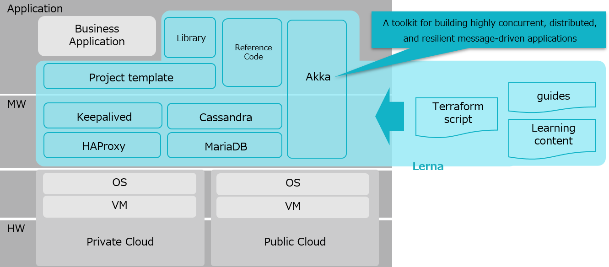
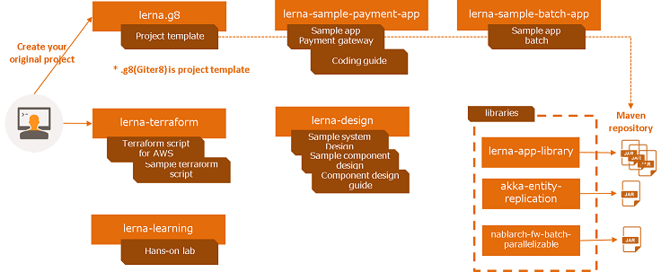

- By executing Lerna's scripts to VMs running on the cloud (public or private), you can build an environment that is configured to achieve high availability and high throughput.
- In that environment, designing and implementing applications based on the actor model ([Akka](https://akka.io/)) and CQRS(Command Query Responsibility Segregation) with Event Sourcing architecture allows you to build highly available systems.
- Libraries and reference implementations for design and implementation are provided.

## Concept

### High availability and high throughput

- Eliminates the bottleneck of writing to the RDBMS by applying the CQRS with Event Sourcing architecture to the application layer
- High Availability and Scalability with Akka Cluster
- Provides responsiveness by making the application stateful, while providing fast failover with guaranteed consistency using Raft

### Platform independent

- Fast failover at the middleware and application layers with platform independence, based on the premise that the server (VM) will stop.
- This ensures high availability independent of hardware and specific cloud environments

### Low cost and fast delivery

- No need to purchase expensive high-availability servers; high availability can be achieved at low cost by using OSS middleware.
- Because it can be built on the cloud, it reduces the lead time for hardware procurement and improves delivery speed.

## Contents

| Name  | Description |
| ----------- | ---- |
| Reference Code  | Coming soon. |
| Project Template | Coming soon. |
| Terraform Script | Coming soon. |
| Guides | Coming soon. |
| Learning Content | Coming soon. |

## Libraries

| Name  | Description |
| ----------- | ---- |
| [akka-entity-replication](https://github.com/lerna-stack/akka-entity-replication) | Akka extension for fast recovery from failure with replicating stateful entity on multiple nodes in Cluster |

* Currently, only akka-entity-replication is available; other content will be released soon.

## License
Lerna is released under the terms of the [Apache License Version 2.0](./LICENSE).

\
\
\* The names of the companies and products described in this site are trademarks or registered trademarks of the respective companies.  
\* Amazon Web Services, AWS are trademarks of Amazon.com, Inc. or its affiliates in the United States and/or other countries.
\* Akka is a trademark of Lightbend, Inc.

© 2020 TIS Inc.

<!-- Global site tag (gtag.js) - Google Analytics -->

